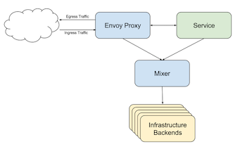
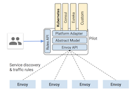

# 1. Modernize digital applications with Microservices management

<!-- TOC -->

- [1. Modernize digital applications with Microservices management](#1-modernize-digital-applications-with-microservices-management)
    - [1.1. Pre-requisites](#11-pre-requisites)
    - [1.2. Overview of Microservices Management](#12-overview-of-microservices-management)
    - [1.3. Deploy application using Kubernetes](#13-deploy-application-using-kubernetes)
    - [1.4. Deploy application using Istio](#14-deploy-application-using-istio)
    - [1.5. Service Graph](#15-service-graph)
    - [1.6. Distributed Tracing](#16-distributed-tracing)
    - [1.7. Viewing Istio Metrics](#17-viewing-istio-metrics)
    - [1.8. Setting Rate Limits](#18-setting-rate-limits)
    - [1.9. Microservice Routing (Optional)](#19-microservice-routing-optional)
- [2. Summary](#2-summary)
- [3. Cleanup](#3-cleanup)

<!-- /TOC -->

## 1.1. Pre-requisites

In your environment, you should have the following components already setup:
 * [Kubernetes V1.10 cluster](https://kubernetes.io/docs/setup/independent/create-cluster-kubeadm/)
 * [Docker V17.03.2](https://docs.docker.com/install/linux/docker-ce/ubuntu/#install-using-the-convenience-script )
 * [kubectl V1.10](https://kubernetes.io/docs/tasks/tools/install-kubectl/#install-kubectl)
 * [Kubernetes storage](https://kubernetes.io/docs/tasks/configure-pod-container/configure-persistent-volume-storage/#create-a-persistentvolume)
 * [Istio V1.0.1](curl -L https://git.io/getLatestIstio | sh -)
 * [Install Istio without security](kubectl apply -f install/kubernetes/istio-demo.yaml)

Alternatively, you can run [Minikube 0.30](https://github.com/kubernetes/minikube/releases) which provides a single node Kubernetes cluster. You will than need to complete the Istio instructions above.

The files for the application can be downloaded [here](https://github.com/cloud-coder/cascon-2018-istio). The ZIP file can be downloaded directly from the Web site or using [git](git@github.com:cloud-coder/cascon-2018-istio.git)

## 1.2. Overview of Microservices Management

 Digital applications for Web, Mobile, and IoT channels are being architected and developed using modernized approaches - microservices design and deployment on container platforms. Microservices design breaks out an application into seperate consumable components / functions. Each component is a building block for a business domain capability that performs a specific function independently from other components. It provides the flexibility to use the programming language, database technology, and runtime that is best designed to solve the problem. Examples of domain-driven design are “fund transfer” services. Examples of non-domain-driven design are Authentication or logging services.

Three common microservice patterns:
- **Backend for Frontend (BFF)**: backend aggregator service that provides an optimized response for frontend applications
- **Business Microservice**: performs a comprehensive function, typically interacting with a database
- **Adapter Microservice**: transforms existing services (ie XML) into REST-based services (ie business focused interface)

In this tutorial, you will deploy an application called *Fancave*, which provides real-time sport news, scores, player and team information for the four major sports leagues (NHL, NBA, MLB, NFL).  The Fancave application consists of 5 microservices, packaged and deployed within its own container. You can view the application running using a Web browser [here](https://fancave.mybluemix.net/index.html#/tabs). The application has been designed as a responsive Web application, so you can resize the browser and the application will resize itself. The tabs at the bottom allow you to switch between the various components (microservices).
- **News**: displays the latest sports news for each major sports league. Click the article preview to read the full article.
- **Scores**: displays the latest scores each day for each major sports league. Click the game to open a new Web browser to view the game details.
- **Players**: displays list of the top 25 players for each major sports league. You can use the search bar to search for players by name. Each player also includes a link to player-specific news and tweets from Twitter.
- **Teams**: displays the sport teams for each league. You can view the list as either a scrolling list or map. You can view the team details, or scores for each specific team.


Optionally, you can also login to the application via an icon on the top right-hand corder, either creating an account with a username/password, or via an existing Google account.


These components are packaged and deployed into the following containers:
- **fancave-news**: container running a Node.js application for the **news** microservice which obtains real-time sports news from an external datasource.
- **fancave-db**: container running a mongo database to support the **players** microservice.
- **fancave-players**:  container running a Node.js application for the **players** microservice which uses the fancave-db container to store  players data database.
- **fancave-teams**: container running a Node.js application for the **teams** microservice which returns information about the various teams and scores for each game, grouped by day.
- **fancave-client**: container running a Node.js application for the user interface. It is developed as a hybrid-based mobile application using responsive design.

Before we get into the details of this tutorial, it is important to understand the difference between an API and Microservice.

- Microservice: building block for a business domain capability that performs a specific function. It is built using a runtime language that is best designed to solve the problem.
- API: securely expose business domain capability from one or more microservices using an ingress (or API Gateway)

	


An API exposes a set of functionality from one or more microservicies at the ingress to the client application. In a microservices-based application, the quantity of runtime components increases, which requires enhanced management capabilities to provide operational resiliency and performance. Container platforms, such as Kubernetes provide scheduling, monitoring and load balancing of containers, but don't manage the interaction between microservices. For example, digital applications need rate limiting between microservices, application-specific load balancing, microservices security, and much more. Istio is a microservices management platform, built on top of Kubernetes, which introduces a [side-car architecture](https://istio.io/docs/concepts/what-is-istio/#architecture) to deliver a comprehensive set of microservices management features. 

In this tutorial, you will learn how Istio can help manage your microservices-based application, specifically you will start with the deployment of the Fancave application into Kubernetes, and then again using Istio, but demonstrating the microservices management features.
 
## 1.3. Deploy application using Kubernetes

The fancave application consists of 5 microservices, whose deployment is grouped info different folders. Each folder contains a Kubernetes deployment and services files.

The artifacts for each microservices are similar. The deployment manifest file defines the cluster port (3080), base image (ozairs/fancave-server:v1), and health checks. An example deployment manifest file for `fancave-players`.

```
apiVersion: extensions/v1beta1
kind: Deployment
metadata:
labels:
	app: players
name: fancave-players
spec:
replicas: 1
template:
	metadata:
	labels:
		app: players
	spec:
	containers:
	- image: ozairs/fancave-server:v1
		name: fancave-players
		ports:
		- containerPort: 3080
```

The health checks for readiness and liveness probe. Different between these probes are defined [here](https://medium.com/spire-labs/utilizing-kubernetes-liveness-and-readiness-probes-to-automatically-recover-from-failure-2fe0314f2b2e).

```
readinessProbe:
	tcpSocket:
	port: 3080
	initialDelaySeconds: 5
	periodSeconds: 15
livenessProbe:
	tcpSocket:
	port: 3080
	initialDelaySeconds: 10
	periodSeconds: 20
```

The kubernetes service manifest file uses the kubernetes deployment labels. The key item for deployment within Istio is to name the port `http`, which ensures that a sidecar proxy (ie Envoy) is deployed alonside the microservice container within the same pod.

```
apiVersion: v1
kind: Service
metadata:
name: fancave-players
labels:
	app: players
spec:
ports:
- port: 3080
	name: http
	protocol: TCP
selector:
	app: players
type: ClusterIP
```

1. Deploy each microservices using kubectl into a single node Kubernetes cluster

	```
    kubectl create -f ./fancave-db/
	kubectl create -f ./fancave-news/
	kubectl create -f ./fancave-players/
	kubectl create -f ./fancave-teams/
	kubectl create -f ./fancave-client/
	```

2. After deployment, you should see the following pods. Their status should display `Running`.

NAME                              READY     STATUS    RESTARTS   AGE
fancave-client-66764c4796-jdzls   1/1       Running   0          20m
fancave-db-c9d67ccb7-r62hx        1/1       Running   0          25m
fancave-news-7b577ff4b7-m45cp     1/1       Running   0          24m
fancave-players-bcfd9bd68-j5ggh   1/1       Running   0          22m
fancave-teams-5c9d65b88c-jvncc    1/1       Running   0          21m

3. Run the Fancave application using the fancave-client microservice. You will first need to determine the IP address of the kubernetes cluster. This should be the IP address of your primary Ethernet interface. If your running on minikube, you can enter the command `minikube ip`. 

4. The port numbers for the cluster is obtained using the command `kubectl get services`. 
	```
		NAME              TYPE        CLUSTER-IP       EXTERNAL-IP   PORT(S)          AGE
		fancave-client    NodePort    10.106.172.189   <none>        3080:30661/TCP   11m
		fancave-db        ClusterIP   10.107.156.186   <none>        27017/TCP        15m
		fancave-news      ClusterIP   10.102.47.229    <none>        3080/TCP         15m
		fancave-players   ClusterIP   10.97.242.203    <none>        3080/TCP         13m
		fancave-teams     ClusterIP   10.104.39.64     <none>        3080/TCP         12m
		kubernetes        ClusterIP   10.96.0.1        <none>        443/TCP          1h
	```

In the above output, use the mapped port from the `fancave-client ..... 3080:30661`, specifically 30661. 

5. The fancave application can be accessed using the URL: `http://<kubernetes_host>:30661/index.html`. Click each microservice (news, scores, players and teams). Once you are satisfied that its working, you can close the Web browser.

6. You were able to successfully deploy the Fancave application using Kubernetes. In the next step, you will deploy it using Istio. Delete the Fancave Application to revert back to a clean environment.

	kubectl delete deployment fancave-client fancave-teams fancave-players fancave-news fancave-db
	kubectl delete service fancave-client fancave-teams fancave-players fancave-news fancave-db
	kubectl delete pvc dbclaim0

## 1.4. Deploy application using Istio

In this section, you will deploy the same Fancave application with Istio. It uses the same principals as a Kubernetes deployment with the exception that Istio deploys a sidecar proxy (Envoy) into each microservices pod. Furthermore, Istio deploys a set of management components (mixer/pilot). The Envoy sidecar communicates with the Mixer/Pilot pods to enforce microservice management policies. The biggest value of this approach is that you don't need to make **any code changes** to your microservices to leverage these policies. Istio policies are provided via YAML and are enforced using Envoy and Mixer/Pilot components, leveraging the underlying platform.

**Background**

**Mixer**

Mixer provides a generic intermediation layer between application code and infrastructure backends. This design moves policy decisions out of the app layer and into configuration, under operator control. Instead of having application code integrate with specific backends, the app code does simple integration with Mixer, which then takes responsibility for interfacing with the backend systems. Mixer is designed to change the boundaries between layers to reduce systemic complexity, eliminating policy logic from application code and giving control to operators instead. 

The Mixer provides three core features:
* Precondition Checking. Enables callers to verify many preconditions before responding to an incoming request from a service consumer. Preconditions can include whether the service consumer is properly authenticated, is on the service’s whitelist, passes ACL checks, and more.
* Quota Management. Enables services to allocate and free quotas on several dimensions. Quotas are used as a relatively simple resource management tool to provide some fairness between service consumers when contending for limited resources. Rate limits are examples of quotas.
* Telemetry Reporting. Enables services to report logging and monitoring.



**Pilot**

Pilot is the core component used for traffic management in Istio, and it manages and configures all the Istio sidecar (Envoy) instances deployed in a particular Istio service mesh. It lets you specify what rules you want to use to route traffic between microservices, and configure failure recovery features such as timeouts, retries and circuit breakers.

It also maintains a canonical model of all the services in the mesh and uses this information to let Istio know about the other instances in the mesh via its discovery service. Each Istio sidecar instance maintains load balancing information based on the information it gets from Pilot and periodic health-checks of other instances in its load-balancing pool, allowing it to intelligently distribute traffic between destination instances while following its specified routing rules.



1.  Deploy application using kubectl with Istio. The standard `kubectl` command is augmented to inject the Envoy sidecar proxy into each microservice pod using `istioctl`. 

	```
	kubectl create -f ./fancave-db/mongodb-claim.yaml
	kubectl create -f <(istioctl kube-inject -f ./fancave-db/mongodb-deployment.yaml)
	kubectl create -f <(istioctl kube-inject -f ./fancave-db/mongodb-service.yaml)

	kubectl create -f <(istioctl kube-inject -f ./fancave-players/fancave-server-deployment.yaml)
	kubectl create -f <(istioctl kube-inject -f ./fancave-players/fancave-server-service.yaml)

	kubectl create -f <(istioctl kube-inject -f ./fancave-news/fancave-server-deployment.yaml)
	kubectl create -f <(istioctl kube-inject -f ./fancave-news/fancave-server-service.yaml)

	kubectl create -f <(istioctl kube-inject -f ./fancave-teams/fancave-server-deployment.yaml)
	kubectl create -f <(istioctl kube-inject -f ./fancave-teams/fancave-server-service.yaml)

    kubectl create -f <(istioctl kube-inject -f ./fancave-client/fancave-client-deployment.yaml)
	kubectl create -f <(istioctl kube-inject -f ./fancave-client/fancave-client-service.yaml)
	```

	Istio includes its own command line `istioctl` which contains its own kubernetes-based resources.

2. You will notice that each microservice contains two containers. The second contained added is the sidecar proxy (Envoy).

	```
	kubectl get pods
	NAME                               READY     STATUS    RESTARTS   AGE
	fancave-client-77f649465c-tgw5s    2/2       Running   0          3d
	fancave-db-54d8cff867-g54zl        2/2       Running   0          3d
	fancave-news-57bb8b7bdf-nt6ks      2/2       Running   0          3d
	fancave-players-7cd5d8bf89-nrptj   2/2       Running   0          3d
	fancave-teams-6dc947fb7d-f695r     2/2       Running   0          3d
	```

 3. Install the Istio Ingress with command `kubectl create -f <(istioctl kube-inject -f ./istio/ingress.yaml)`. The Istio ingress gateway is needed for routing to each microservice. 

	```
	kubectl get gateway
	NAME              AGE
	fancave-gateway   47s

	kubectl get virtualservice
	NAME      AGE
	fancave   4m
	```

4. Install the Istio Egress with command `kubectl create -f <(istioctl kube-inject -f ./istio/egress.yaml)`. The egress gateway is needed to route to services outside the mesh. Specifically, real-time sports information is obtained from an external source.

	```
	kubectl get svc istio-egressgateway -n istio-system
	NAME                  TYPE        CLUSTER-IP      EXTERNAL-IP   PORT(S)          AGE
	istio-egressgateway   ClusterIP   10.97.150.148   <none>        80/TCP,443/TCP   3d
	```

5. You will need to obtain the Fancave endpoint to run the Fancave application using the Web browser. Depending on your environment, the values will be different. The IP address will be the same as the previous section, but the port number will be based on the ingress gateway resource.

	```
	kubectl get svc istio-ingressgateway -n istio-system
	NAME                   TYPE           CLUSTER-IP       EXTERNAL-IP   PORT(S) AGE
	istio-ingressgateway   LoadBalancer   10.102.150.235   <pending>     80:31380/TCP,443:31390/TCP,31400:31400/TCP,15011:31196/TCP,8060:31368/TCP,853:31924/TCP,15030:32303/TCP,15031:31156/TCP   2d
	```

	You can obtain the ingress port number by executing the following command:

	```
	export INGRESS_PORT=$(kubectl get svc istio-ingressgateway -n istio-system -o 'jsonpath={.items[0].status.hostIP}'):$(kubectl get svc istio-ingressgateway -n istio-system -o 'jsonpath={.spec.ports[0].nodePort}')
	export GATEWAY_URL='http://'$(hostname)$INGRESS_PORT'/index.html'
	echo $GATEWAY_URL
	```

6. Open a Web browser and enter the URL from the command prompt. Navigate the Fancave application to make sure each microservice is working as desired.

In the next sections, you will explore the Istio-specific functionality. 

## 1.5. Service Graph

In this section, you will use the built-in Istio plugin to dynamically build a service graph which shows the various container dependencies. Deploying an application within Istio, provides the flexibility to gather metrics in a common way, allowing you to leverage built-in tooling for enhanced operational visibility.

The service graph plugin provides a visual view of the dependencies between each microservice. You can simply open a Web browser link to the service graph plugin.

1. Make sure the service graph is running using the command `kubectl get service servicegraph -n istio-system`

	```
	NAME           TYPE        CLUSTER-IP      EXTERNAL-IP   PORT(S)    AGE
	servicegraph   ClusterIP   10.104.72.143   <none>        8088/TCP   3d
	```

2. Run the service graph service using `port-forward`. The service is not exposed at the cluster level, so you need to use use port forwarding to access the service from your machine.

	```
	kubectl -n istio-system port-forward $(kubectl -n istio-system get pod -l app=servicegraph -o jsonpath='{.items[0].metadata.name}') 8088:8088 &
	```

3. Using the Web browser, enter the URL `http://127.0.0.1:8088/force/forcegraph.html`. You should see the following graph.

	![alt]images/servicegraph.png)

## 1.6. Distributed Tracing

In this section, you will use the tracing plugin to view tracing information between microservices. In a microservices-based application, the number of microservices invoked will increase, which requires additional operational visibiltiy when debugging transactions. Istio provides built-in support with Jaegar to visually view the latency for each transaction across all the microservices. You can simply open a Web browser link to the tracing plugin.

1. Make sure the tracing service is running using the command `kubectl get service jaeger-query -n istio-system`

	```
	NAME           TYPE        CLUSTER-IP       EXTERNAL-IP   PORT(S)     AGE
	jaeger-query   ClusterIP   10.100.168.127   <none>        16686/TCP   3d
	```

2. Run the Jaeger service using `port-forward`. The service is not exposed at the cluster level, so you need to use use port forwarding to access the service from your machine.

	```
	 	kubectl port-forward -n istio-system $(kubectl get pod -n istio-system -l app=jaeger -o jsonpath='{.items[0].metadata.name}') 16686:16686 &
	```

3. Using the Web browser, enter the URL `http://127.0.0.1:16686/`. You should see the Jaegar UI. Navigate back to the Fancave application and click the various microservices so you can generate trace data.

	

4. In the vertical navigation bar, select the service `istio-ingressgateway` and click **Find Traces**. You should see the various microservices called as part of the transaction.

	

Note: Tracing requires propagation of the following HTTP headers, which is already built into the Fancave application.
  * x-request-id
  * x-b3-traceid
  * x-b3-spanid
  * x-b3-parentspanid
  * x-b3-sampled
  * x-b3-flags
  * x-ot-span-context

## 1.7. Viewing Istio Metrics

In this section, you will examine runtime metrics generated from microservices. Unlike, previous Istio sections, you will need to deploy Istio policy files describing the metrics that you want to generate. 

1. Open the `istio/metrics.yaml` file. You will notice three sections (separated with ---) which provides the metrics definitions. 

In the first part, you define the (generic) metric you want to capture. In this definition, each time the service is called, it will generate a value of 1, for the `source` and `destination` service. The `source.service` and `source.destination` are based on the kubernetes service manifest `name` field.

```
value: "1" # count each request twice
dimensions:
	source: source.service | "unknown"
	destination: destination.service | "unknown"
	message: '"New request!"'
```

In the second part, it defines a prometheus handler and how it will be represented within prometheus.

```
spec:
metrics:
- name: request_count # Prometheus metric name
	instance_name: requestcount.metric.istio-system # Mixer instance name (fully-qualified)
	kind: COUNTER
	label_names:
	- source
	- destination
	- message
```

In the third part, you combine part 1 and part 2 together to create an Istio rule. 
	
```
spec:
actions:
- handler: handler.prometheus
	instances:
	- requestcount.metric
```

The `istio\metrics-db.yaml` is configured similarly to the `metrics.yaml` file.

2. Run the following commands to create the Istio rules:

	```
	kubectl create -f <(istioctl kube-inject -f ./istio/metrics.yaml)
	kubectl create -f <(istioctl kube-inject -f ./istio/metrics-db.yaml)
	```

3. Run the prometheus handler using `port-forward` kubectl command.

	```
	kubectl -n istio-system port-forward $(kubectl -n istio-system get pod -l app=prometheus -o jsonpath='{.items[0].metadata.name}') 9090:9090 &
	```

4. Open a Web browser and enter the URL http://127.0.0.1:9090/graph. This should display the Promethus UI. 

5. Refresh the Fancave application and click the various microservices to generate metrics data.

6. Enter the query `istio_request_count`. You should see the request count for each service call.

7. Repeat the step with the query `mongo_sent_bytes`. You should see the number of bytes sent.

## 1.8. Setting Rate Limits

In this section, you will configure Istio policies to control access to microservices based on a rate limit. Since the `fancave-players` microservice uses a database, you will configure a rate limit policy that prevents that database from being overwhelmed. For demonstration purposes, you will only allow 3 requests every 10 seconds. The Istio rate limit module can use memory or a redis database. The latter option provides additional policies. For demo purposes, you will use the memory option.

1. Open the `istio/rate-limit.yaml` file. There are several sections needed to create a rate limit policy. You will only focus on the first definition, since it defines the main policy information

	```
		quotas:
		- name: requestcount.quota.istio-system
			maxAmount: 5000 # default rate limit is 5000qps
			validDuration: 1s
			# The first matching override is applied.
			# A requestcount instance is checked against override dimensions.
			overrides:
			- dimensions:
				destination: players
			maxAmount: 3
			validDuration: 10s
	```

	This policy defines a default rate limit of 5000 if no match is provided. If the service named under `overrides` is named `players`, which is identified using `destination.labels["app"]` than the rate limit policy is 3 (`maxAmount`) every 10 seconds (`validDuration`).

  2. Create the rate limit policy with the command `kubectl create -f <(istioctl kube-inject -f ./istio/rate-limit.yaml)`

  3. Click the Players tab and select each league. The fourth league selected within 10 seconds will trigger the rate limit with an error (response code 429) since the threshold is exceeded. You can use any debugger tools (ie Google Chrome Developer Tools) to examine the response code to validate the rate limit policy is triggered. Once each league is clicked, the data will be cached, so if you want to trigger the rate limit again, you will need to refresh the Web page.

## 1.9. Microservice Routing (Optional)

In this section, you will explore the configuration for routing rules. You can optionally create Istio policies with these rules to experiment but no detailed instructions are provided.

Create rules for routing to destination services with a specific version (`v1`). Example snippet below, 
  ```
  kind: RouteRule
  metadata:
    name: fancave-players
    namespace: default
    ...
  spec:
    destination:
      name: players
    precedence: 1
    route:
    - labels:
        version: v1
  ```

  The `spec` stanza also defines a match attribute that performs routing based on a cookie header with name `jason`, for example
  ```
  match
    request:
        headers:
          cookie:
            regex: ^(.*?;)?(user=jason)(;.*)?$
  ```

  The `spec` stanza can include a simulated (backend) latency to the requesting service
  ```
  httpFault:
    delay:
      fixedDelay: 7.000s
      percent: 100
  ```

  Similarly, the `spec` stanza can enforce a request timeout to limit calling services
  ```
  httpReqTimeout:
    simpleTimeout:
      timeout: 1s
  ```

  The `spec -> route` stanza can perform content-based routing based on the microservice selector using the *weight* attribute to distribute traffic based on a weighted load balancer algorithm.
  ```
  route:
  - labels:
      version: v1
    weight: 90
  - labels:
      version: v3
    weight: 10
  ```

# 2. Summary

In this tutorial, you learned how to build and deploy a modernized digital applications using Kubernetes and then again using Istio, leveraging its microservices-management capabilities.

# 3. Cleanup

You can remove the fancave application and the istio policies with the following commands:


```
kubectl delete deployment fancave-client fancave-teams fancave-players fancave-news fancave-db
kubectl delete service fancave-client fancave-teams fancave-players fancave-news fancave-db
kubectl delete pvc dbclaim0
kubectl delete -f <(istioctl kube-inject -f ./istio/ingress.yaml)
kubectl delete -f <(istioctl kube-inject -f ./istio/egress.yaml)
kubectl delete -f <(istioctl kube-inject -f ./istio/metrics.yaml)
kubectl delete -f <(istioctl kube-inject -f ./istio/metrics-db.yaml)
kubectl delete -f <(istioctl kube-inject -f ./istio/rate-limit.yaml)
```